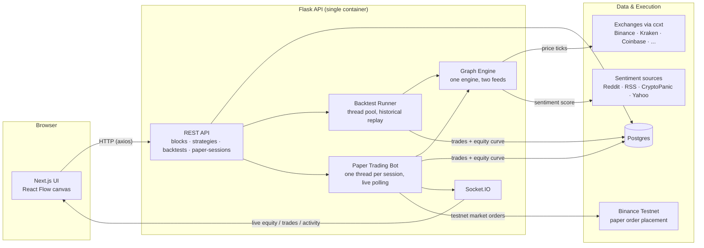

# f8n

**A free, open, no-login tool for visually building crypto trading agents — backtest them against real historical data, then run them as paper-trading agents. No real money is ever used.**

[](https://opensource.org/licenses/MIT)
[](https://nextjs.org/)
[](https://flask.palletsprojects.com/)
[](#safety-this-is-a-paper-trading-tool)

---

## Table of Contents

- [What this is](#what-this-is)
- [Architecture](#architecture)
- [How an agent works](#how-an-agent-works)
- [Available blocks](#available-blocks)
- [Tech stack](#tech-stack)
- [Getting started](#getting-started)
- [Configuration](#configuration)
- [Project structure](#project-structure)
- [Testing](#testing)
- [Deployment](#deployment)
- [Safety: this is a paper-trading tool](#safety-this-is-a-paper-trading-tool)
- [Known limitations](#known-limitations)
- [Contributing](#contributing)
- [License](#license)

---

## What this is

f8n lets anyone build a crypto trading agent **visually**, on an n8n-style block canvas, without writing code:

1. **Build** — drag blocks (price feeds, sentiment, math, logic, actions) onto a canvas and wire them together.
2. **Backtest** — replay the exact same graph against real historical market data.
3. **Deploy** — run the exact same graph live, as a paper-trading agent, and watch trades happen in real time.

There are **no accounts and no login** — every agent, backtest, and paper session is open to anyone with the link. This is a free tool, not a multi-tenant SaaS product.

## Architecture



The same **Graph Engine** drives both paths — a backtest replays historical bars through it, a paper session polls live prices through it — so an agent is provably running the exact logic it was tested with. See [`app/graph/engine.py`](f8n-Backend/app/graph/engine.py).

## How an agent works

An agent is a directed graph of **blocks**. A cross-exchange arbitrage agent, for example:

```
[Binance BTC/USDT] ─┐
                     ├─▶ [Spread %] ─▶ [Threshold] ─▶ [Paper Buy]
[Kraken BTC/USDT]  ──┘
```

A sentiment-driven agent instead reads a sentiment score and reacts to it:

```
[Sentiment: BTC-USD] ─▶ [Sentiment Score] ─▶ [Threshold] ─▶ [Paper Buy]
```

The block palette (`GET /api/blocks`) is the single source of truth for what blocks exist — the frontend renders its node palette and config forms directly from it, so backend and UI can never drift out of sync.

## Available blocks

| Category | Block | What it does |
|---|---|---|
| Source | **Exchange Price** | Live/historical price for a symbol on one exchange (pluggable via [ccxt](https://github.com/ccxt/ccxt): Binance, Kraken, Coinbase, KuCoin, Bybit) |
| Source | **Sentiment Score** | Reddit + news sentiment for a ticker, from independently toggleable free sources (see below) |
| Indicator | **Spread %** | `(price_b − price_a) / price_a × 100` — the arbitrage spread |
| Indicator | **Sentiment Score** | Reduces a positive/negative/neutral breakdown to one scalar |
| Logic | **Threshold** | Fires when a value crosses an operator/threshold |
| Logic | **AND / OR** | Combine two boolean inputs |
| Action | **Paper Buy / Sell** | Places a simulated (or Binance-testnet) order when triggered |
| Action | **Log** | Records a note to the run's activity feed |

Adding a new block is adding one class to the registry (`app/blocks/`) — nothing else needs to change.

### Sentiment sources (all configurable per agent)

| Source | Cost | Setup |
|---|---|---|
| **RSS headlines** (CoinDesk + Cointelegraph) | Free, forever | None — on by default |
| **Reddit** (r/CryptoCurrency, r/CryptoMarkets, r/Bitcoin) | Free | A free Reddit "script" app |
| **CryptoPanic** | Free tier | A free API key |
| **Yahoo Finance headlines** | Free | None |

Sentiment scoring itself uses [VADER](https://github.com/cjhogan/vaderSentiment) plus a small finance/crypto lexicon layered on top (words like "bullish", "rug pull", "rekt") — pure Python, no GPU, no multi-gigabyte model download. See [`app/sentiment_engine/pipeline.py`](f8n-Backend/app/sentiment_engine/pipeline.py).

## Tech stack

| | |
|---|---|
| **Frontend** | [Next.js](https://nextjs.org/) (App Router), [React Flow](https://reactflow.dev/) for the canvas, Tailwind CSS, Recharts, [SWR](https://swr.vercel.app/), Socket.IO client |
| **Backend** | [Flask](https://flask.palletsprojects.com/), SQLAlchemy + Postgres, Flask-Migrate, Flask-SocketIO, [ccxt](https://github.com/ccxt/ccxt) |
| **Sentiment** | VADER + a finance/crypto lexicon, `praw` (Reddit), `feedparser` (RSS), CryptoPanic, `yfinance` |
| **Deployment** | Frontend on [Vercel](https://vercel.com/); backend as a plain, platform-agnostic Docker container (Render, Railway, Fly.io, or any VPS) |

## Getting started

This is a two-part project: `f8n/` (Next.js frontend) and `f8n-Backend/` (Flask backend).

### 1. Backend (Docker Compose — recommended)

```bash
cd f8n-Backend
cp .env.example .env
docker compose up --build
```

This runs Postgres + the Flask API (migrations applied automatically) on `http://localhost:8000`.

### 2. Frontend

```bash
cd f8n
cp .env.example .env.local
npm install --force   # --force: the project intentionally pins a React 19 RC build
npm run dev
```

Open [http://localhost:3000](http://localhost:3000) and build your first agent — no sign-up required.

## Configuration

Nothing below is required to get a price-based (non-sentiment) arbitrage agent running end to end. Everything else is a free, optional upgrade.

**Backend (`f8n-Backend/.env`)**

| Variable | Purpose | Required? |
|---|---|---|
| `SECRET_KEY` | Flask signing secret | Yes (any string) |
| `DATABASE_URL` | Postgres connection string | Recommended (sqlite fallback for local dev) |
| `CORS_ORIGINS` | Frontend origin(s) allowed to call the API | Yes |
| `BINANCE_TESTNET_API_KEY` / `BINANCE_TESTNET_SECRET` | Places real (fake-money) orders on [Binance Testnet](https://testnet.binance.vision) | No — simulated fill used otherwise |
| `REDDIT_CLIENT_ID` / `REDDIT_CLIENT_SECRET` / `REDDIT_USER_AGENT` | Enables the Reddit sentiment source ([free app](https://www.reddit.com/prefs/apps)) | No — skipped if unset |
| `CRYPTOPANIC_API_KEY` | Enables the CryptoPanic sentiment source ([free key](https://cryptopanic.com/developers/api/)) | No — skipped if unset |

**Frontend (`f8n/.env.local`)**

| Variable | Purpose |
|---|---|
| `NEXT_PUBLIC_API_URL` | Base URL of the Flask API |
| `NEXT_PUBLIC_SOCKET_URL` | Base URL for the Socket.IO live-updates connection |

## Project structure

```
f8n-Backend/
├── app/
│   ├── blocks/          # Block registry + concrete blocks
│   ├── graph/            # GraphEngine + execution contexts (historical vs. live)
│   ├── execution/         # Shared paper-money fill/PnL simulation
│   ├── marketdata/         # ccxt exchange adapter + historical OHLCV cache
│   ├── sentiment_engine/    # VADER + lexicon, Reddit/RSS/CryptoPanic/Yahoo sources
│   ├── backtest/             # Replays a graph over historical data
│   ├── papertrading/          # Runs a graph on a live polling loop
│   ├── api/                    # Flask blueprints (no auth - open by design)
│   └── models/                  # SQLAlchemy models
└── tests/                         # Deterministic, network-free unit + API tests

f8n/
├── src/app/                # strategies (builder) · backtest · paper-trading · dashboard
├── src/components/agent-builder/  # React Flow node, config panel, block palette
└── src/lib/                # api client, socket client, SWR fetcher
```

## Testing

```bash
cd f8n-Backend
pip install -r requirements.txt
pytest
```

The suite covers block math, the graph engine, the backtest/portfolio simulation, sentiment scoring, and API smoke tests — all deterministic and network-free. Exercising live ccxt/Reddit/Binance/RSS calls is a manual step (see Getting Started).

```bash
cd f8n
npm run build   # type-checks + production build
```

## Deployment

- **Frontend** deploys to Vercel as-is.
- **Backend** ships as a single Docker image (gunicorn + eventlet) that honors `$PORT` — it runs unmodified on Render, Railway, Fly.io, or any VPS. It is **not** suited to serverless/edge platforms (e.g. Cloudflare Workers): the paper-trading bot is a long-running background thread per session, so it needs a persistent process. A CDN can still sit in front of it.
- Background jobs (backtests, paper sessions) run in-process via a thread pool — no Celery/Redis needed for a single instance.

## Safety: this is a paper-trading tool

- The only exchange leg that can ever place a real order is Binance, and only against the **Binance Testnet** (fake funds). Every other exchange leg is a simulated fill against that exchange's real live price.
- There is no code path in this project that can place a real-money order.
- There are no accounts — anyone with a link to an agent, backtest, or paper session can view or control it. Don't put anything in a strategy name/description you wouldn't want public.

## Known limitations

- **Backtesting a sentiment-driven agent is approximate.** Sentiment sources are live-scraped, not historical — a backtest holds the nearest real snapshot flat across time gaps, and falls back to a single live fetch if no snapshot exists yet. Accuracy improves the longer a paper agent has been running and accumulating real snapshots.
- **Single-instance background jobs.** Backtests and paper sessions run in an in-process thread pool; scaling the API past one instance would need Celery/Redis instead.
- **No cooldown/position-cap blocks yet** — a triggered condition fires every tick it holds true, until paper capital runs out. Realistic for "keep buying while the opportunity exists," but there's no built-in debounce block yet.

## Contributing

1. Fork the project
2. Create your feature branch (`git checkout -b feature/NewBlock`)
3. Commit your changes
4. Push to the branch
5. Open a Pull Request

## License

Distributed under the MIT License. See [`LICENSE`](LICENSE) for details.
